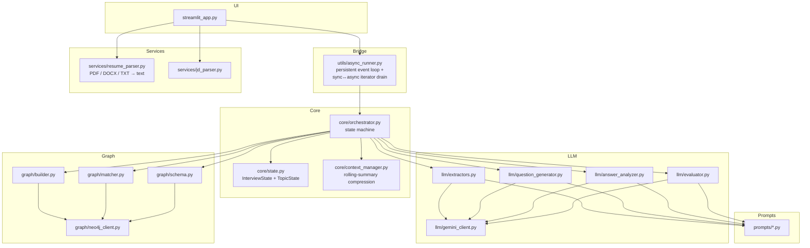
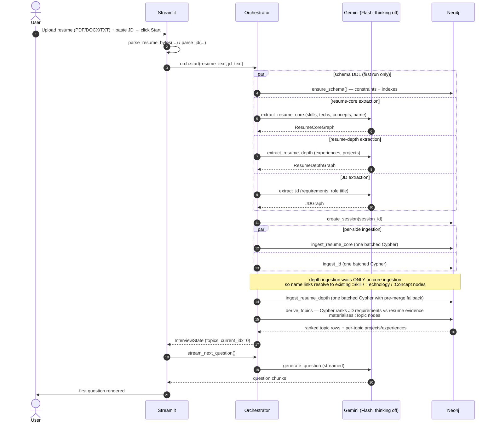
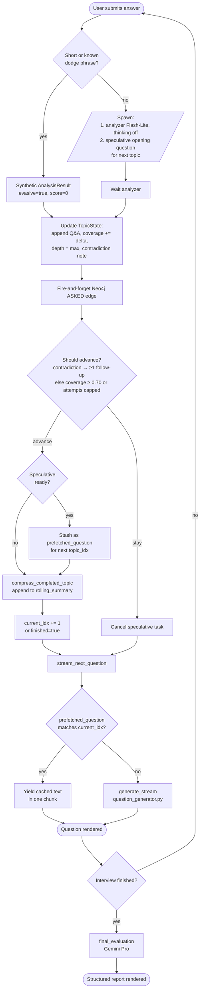
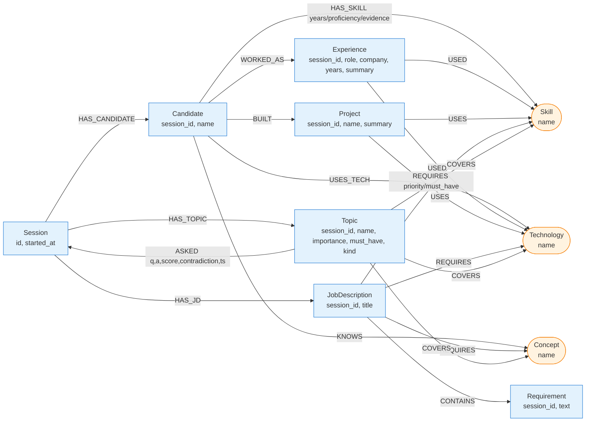

# Architecture & Flow

Visual reference for how the Interview Agent works end-to-end. All diagrams use Mermaid (renders inline on GitHub / VS Code / most Markdown viewers).

---

## 1. Component map



**Reading the layers**

- **UI** — single-file Streamlit app, no business logic.
- **Bridge** — Streamlit is sync; Gemini async client + Neo4j async driver bind to the loop they're awaited on. A persistent daemon-thread event loop (created once via `lru_cache`) lets the UI submit coroutines via `run_coroutine_threadsafe`.
- **Core** — the orchestrator owns the interview state machine. It knows nothing about Streamlit or specific LLM providers; it composes Graph + LLM modules.
- **LLM** — single Gemini client, four task-specific helpers wrapping it.
- **Graph** — single async Neo4j driver; schema/builder/matcher each own one concern.

---

## 2. Setup flow — from upload to first question

The expensive path. Designed so three Gemini calls and a Neo4j DDL run concurrently and ingestion overlaps with extraction wherever ordering allows.



**Step-by-step**

1. **Parse uploads** — `services/resume_parser.py` extracts plain text from PDF/DOCX/TXT; `jd_parser.py` cleans the pasted JD.
2. **Orchestrator start** — generates a 12-char `session_id` (`uuid4().hex[:12]`).
3. **Schema** — `ensure_schema()` runs idempotent DDL (constraints + indexes). Started **in parallel** with extraction; only the first interview pays its ~500 ms.
4. **Three parallel Gemini extractions** — all use Flash with `thinking_budget=0`:
   - `extract_resume_core`: skills + technologies + concepts + candidate name
   - `extract_resume_depth`: experiences + projects with their used-tech lists
   - `extract_jd`: requirements with priority/must-have + role title
5. **Session root** — `create_session()` MERGEs a `:Session {id}` node.
6. **Per-side batched ingestion** — each `ingest_*` is a single Cypher with `CALL { ... }` subqueries. Resume-core ingests the moment its extraction lands, JD likewise. **Depth ingestion waits for core ingestion** so name links to skill/tech/concept nodes resolve. Depth has a pre-merge step that creates any referenced name as `:Skill` if missing — no `USED` / `USES` edge gets silently dropped.
7. **Topic derivation** — `derive_topics()` runs one Cypher that:
   - Joins JD `:REQUIRES` against the candidate's `:HAS_SKILL` / `:USES_TECH` / `:KNOWS` / project tech / experience tech
   - Computes `importance = priority×2 + (must_have?3:0) + evidence_strength − gap_penalty`
   - Materialises `:Topic` nodes with `[:COVERS]` to the underlying skill/tech/concept
   - Returns ranked list including projects + experiences per topic for question grounding
8. **InterviewState built** — top-N topics (`MAX_TOPICS`, default 8) become `TopicState` objects, first one set to `active`.
9. **First question** — Streamlit triggers `stream_next_question`; orchestrator streams the opening question for topic 0.

---

## 3. Interview loop — answer → analysis → next question

The hot path. Several optimisations layered in to keep perceived latency low.



**Key behaviours encoded above**

| Behaviour | Where |
|---|---|
| Short-answer bypass | `_cheap_analysis` in `core/orchestrator.py` |
| Speculative prefetch (parallel with analyzer) | `submit_answer` in `core/orchestrator.py` |
| Fire-and-forget Q&A audit write | `_safe_record_qa` in `core/orchestrator.py` |
| Advance rule (coverage ≥ 70 % OR attempts ≥ max) | `_should_advance` in `core/orchestrator.py` |
| Force at least one follow-up on contradiction | same predicate |
| Rolling summary build on topic close | `compress_completed_topic` in `core/context_manager.py` |
| Cite resume claim on contradictions | `prompts/question.py` + `analysis.py` |
| Question grounded in candidate's actual projects/experiences | `core/context_manager.build_question_vars` |

---

## 4. Knowledge graph schema



**Conventions**

- **Blue (session-scoped)** nodes carry a `session_id` property. Per-interview data; one set per `:Session`.
- **Orange (shared)** nodes (`:Skill`, `:Technology`, `:Concept`) are keyed by canonical lowercase `name` and shared across sessions. Session isolation is enforced via traversal (always start from `:Session {id}` or `:Candidate {session_id}`), not via per-session copies.
- **`:ASKED`** is the audit-trail relationship — every Q&A turn is appended as an edge from the topic to the session.

---

## 5. Module responsibilities at a glance

| File | Responsibility |
|---|---|
| `app/streamlit_app.py` | Two-screen UI (upload, interview). No domain logic. |
| `app/utils/async_runner.py` | Persistent background event loop; `runner.run(coro)` and `runner.stream(async_gen)` for Streamlit. |
| `app/core/orchestrator.py` | Public API: `start`, `next_question`, `submit_answer`, `finalize`, `cleanup`. Owns state + advance rules + speculative prefetch + short-answer bypass. |
| `app/core/state.py` | `TopicState`, `InterviewState` dataclasses. |
| `app/core/context_manager.py` | Builds variable dict for the question prompt; compresses completed topics into the rolling summary. |
| `app/llm/gemini_client.py` | Async Gemini wrapper — `generate_text`, `generate_structured`, `generate_stream` with `thinking_budget` plumbing and tenacity retry. |
| `app/llm/extractors.py` | Pydantic schemas + `extract_resume_core`, `extract_resume_depth`, `extract_jd`. |
| `app/llm/question_generator.py` | Streaming + non-streaming question generation. |
| `app/llm/answer_analyzer.py` | Structured `AnalysisResult` (correctness/depth/relevance/coverage_delta/contradiction/contradiction_evidence/evasive/follow_up_hint). |
| `app/llm/evaluator.py` | Final structured `EvaluationReport` (per-topic + recommendation). |
| `app/graph/neo4j_client.py` | Async driver factory + `run` / `run_write` helpers. |
| `app/graph/schema.py` | Idempotent DDL (constraints + indexes). |
| `app/graph/builder.py` | `create_session`, `ingest_resume_core`, `ingest_resume_depth`, `ingest_jd` — each one batched Cypher. |
| `app/graph/matcher.py` | `derive_topics` (rank + materialise `:Topic`) and `record_qa` (audit). |
| `app/services/resume_parser.py` | PDF (pypdf) / DOCX (python-docx) / TXT extraction. |
| `app/services/jd_parser.py` | Whitespace + line cleanup. |
| `app/prompts/*.py` | Versioned prompt strings, separated from code. |
| `app/config.py` | Env-driven settings (model names, threshold, max followups, max topics). |
| `app/utils/parallel.py` | `gather_with_timeout`, `fire_and_forget`. |
| `app/utils/logger.py` | stdlib logger pre-configured. |

---

## 6. Latency design summary

| Stage | Optimisation | Where |
|---|---|---|
| Resume + JD extraction | Flash with `thinking_budget=0`, three calls in parallel (resume split into core + depth) | `extractors.py` |
| Schema DDL | Runs concurrently with extraction (only first interview pays ~500 ms) | `orchestrator.start` |
| Resume / JD ingestion | Single Cypher per side, `CALL { ... }` subqueries (was 5+1 round-trips, now 1+1) | `builder.py` |
| Per-side pipeline | Each ingestion fires the moment its extraction lands; depth waits only on core | `orchestrator.start` |
| Question generation | Streamed token-by-token to UI | `question_generator.py` |
| Answer analyzer | Flash-Lite + `thinking_budget=0` | `answer_analyzer.py` (when wired) |
| Speculative next-question prefetch | Generated in parallel with analyzer; cached if we advance, cancelled if we follow-up | `orchestrator.submit_answer` + `_pop_prefetched` |
| Q&A audit write | Fire-and-forget background task | `_safe_record_qa` |
| Short-answer bypass | Skip LLM entirely on obvious dodges | `_cheap_analysis` |
| Streamlit ↔ async | One persistent loop, `lru_cache`'d driver/client | `utils/async_runner.py` |

---

## 7. Threshold & tuning knobs

All env-driven (`.env` / `.env.example`):

| Variable | Default | Effect |
|---|---|---|
| `GEMINI_MODEL_FAST` | `gemini-2.5-flash` | Question gen, answer analyzer, extractors |
| `GEMINI_MODEL_PRO` | `gemini-2.5-pro` | Final evaluator |
| `GEMINI_MODEL_LITE` | `gemini-2.5-flash-lite` | Reserved for analyzer fast-path |
| `COVERAGE_THRESHOLD` | `0.70` | Advance when current topic's coverage ≥ this |
| `MAX_FOLLOWUPS` | `3` | Hard cap on attempts per topic before forced advance |
| `MAX_TOPICS` | `8` | Top-N ranked topics interviewed per session |

---

## 8. Reading the graph in Neo4j Browser

After an interview run, in <http://localhost:7474>:

```cypher
// All nodes for a session
MATCH (n) WHERE n.session_id = $sid RETURN n;

// Ranked topics
MATCH (s:Session {id:$sid})-[:HAS_TOPIC]->(t:Topic)
RETURN t.name, t.importance, t.must_have ORDER BY t.importance DESC;

// Audit trail (Q&A history)
MATCH (t:Topic {session_id:$sid})-[r:ASKED]->(:Session {id:$sid})
RETURN t.name, r.question, r.answer, r.score, r.contradiction, r.ts ORDER BY r.ts;

// Why this topic? — projects + experiences linked to it
MATCH (t:Topic {session_id:$sid, name:$name})-[:COVERS]->(target)
OPTIONAL MATCH (c:Candidate {session_id:$sid})-[:BUILT]->(p:Project)-[:USES]->(target)
OPTIONAL MATCH (c)-[:WORKED_AS]->(x:Experience)-[:USED]->(target)
RETURN t.name, target.name, collect(DISTINCT p.name) AS projects,
       collect(DISTINCT x.role) AS experiences;
```

Replace `$sid` with the session id (visible in the Streamlit sidebar).
